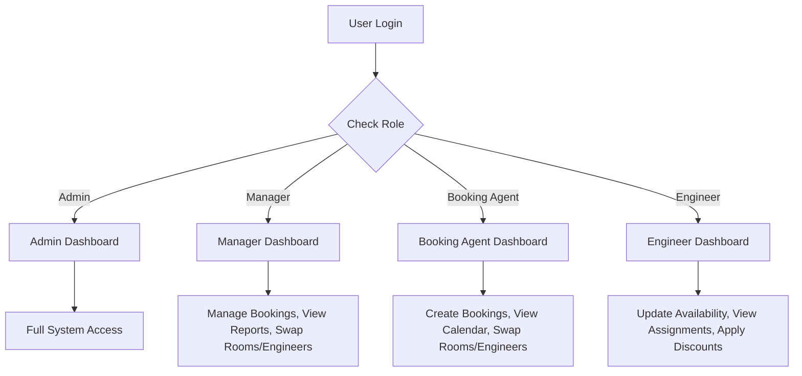
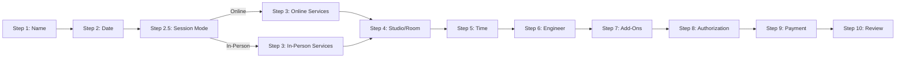
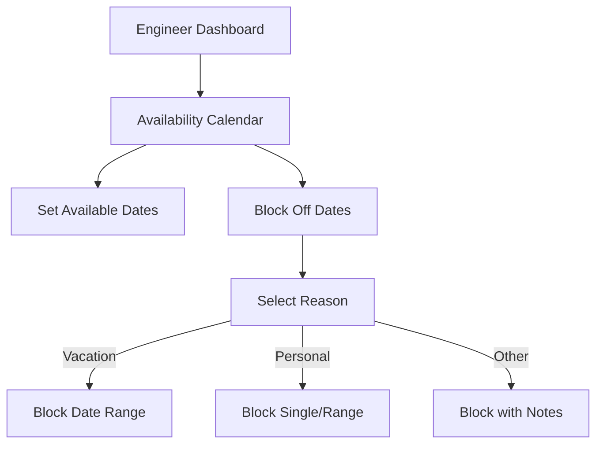
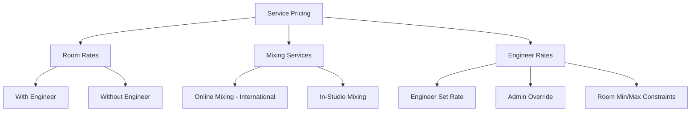
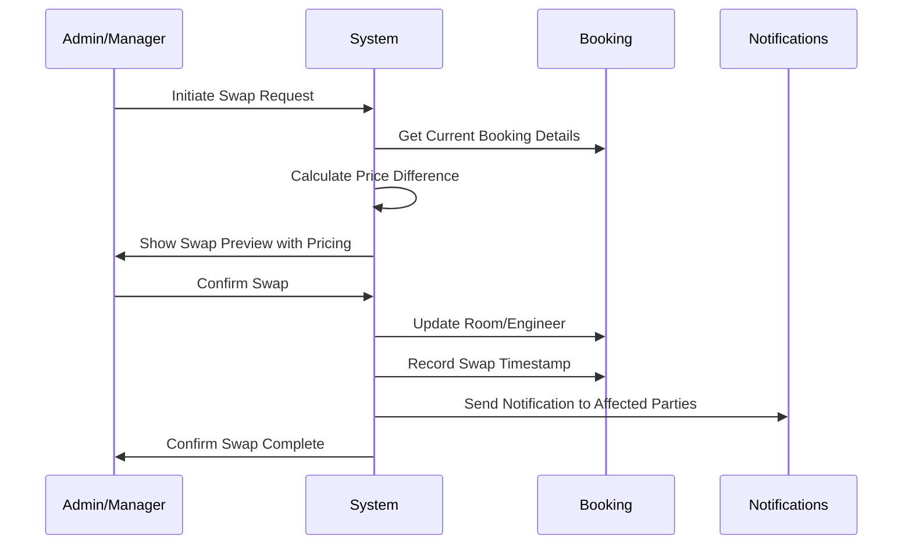

# Platinum Sound Studios - Implementation Plan

## Executive Summary

This document outlines the comprehensive implementation plan for 18 new system requirements for Platinum Sound Studios booking and management platform. The current system is built with:
- **Frontend**: Next.js 14 with React, TypeScript, Tailwind CSS
- **Backend**: Next.js API Routes with Prisma ORM
- **Database**: PostgreSQL
- **Authentication**: NextAuth.js

---

## Current System Analysis

### Existing Features
- Basic booking system with 6-step wizard
- Client management
- Invoice generation
- Staff/Team management
- Basic inventory tracking
- Task management with recurring tasks
- Schedule view (day-by-day)
- Marketing email/SMS pages

### Current Database Schema
```
User (id, email, name, password, role)
Client (id, name, email, phone, label, project, budget, status)
Booking (id, clientId, studio, date, startTime, endTime, engineer, sessionType, status)
Invoice (id, clientId, amount, status, dueDate, items)
Staff (id, name, email, phone, role, specialty, status)
Settings (id, key, value)
Task (id, title, description, status, priority, assigneeId, dueDate, recurrence)
```

### Current Roles
- ADMIN
- MANAGER
- ENGINEER

---

## Implementation Phases

## Phase 1: Database Schema Updates

### 1.1 New Models Required

#### Authorization Model
```prisma
model BookingAuthorization {
  id          String   @id @default(cuid())
  bookingId   String
  booking     Booking  @relation(fields: [bookingId], references: [id])
  signedAt    DateTime @default(now())
  signatureType String  // DIGITAL_SIGNATURE or CHECKBOX_ACKNOWLEDGMENT
  ipAddress   String?
  userAgent   String?
  acknowledged Boolean @default(false)
}
```

#### Enhanced User/Role System
```prisma
enum Role {
  ADMIN
  MANAGER
  BOOKING_AGENT
  ENGINEER
}

model User {
  // ... existing fields
  phone          String?
  availability   EngineerAvailability[]
  assignedRooms  RoomAssignment[]
  discountLimit  Float?
  profile        UserProfile?
}

model UserProfile {
  id        String   @id @default(cuid())
  userId    String   @unique
  user      User     @relation(fields: [userId], references: [id])
  bio       String?
  avatar    String?
  preferences Json?
  createdAt DateTime @default(now())
  updatedAt DateTime @updatedAt
}

model EngineerAvailability {
  id          String   @id @default(cuid())
  engineerId  String
  engineer    User     @relation(fields: [engineerId], references: [id])
  date        DateTime
  status      AvailabilityStatus
  blockedReason String?
  createdAt   DateTime @default(now())
  updatedAt   DateTime @updatedAt
  
  @@unique([engineerId, date])
}

enum AvailabilityStatus {
  AVAILABLE
  BLOCKED
  VACATION
  SICK
}
```

#### Room Management
```prisma
model Room {
  id              String   @id @default(cuid())
  name            String   @unique
  description     String?
  baseRate        Float
  rateWithEngineer Float
  rateWithoutEngineer Float
  status          RoomStatus @default(AVAILABLE)
  amenities       Json?
  images          Json?
  createdAt       DateTime @default(now())
  updatedAt       DateTime @updatedAt
  assignments     RoomAssignment[]
  lockouts        RoomLockout[]
}

enum RoomStatus {
  AVAILABLE
  MAINTENANCE
  LOCKED
}

model RoomAssignment {
  id          String   @id @default(cuid())
  roomId      String
  room        Room     @relation(fields: [roomId], references: [id])
  engineerId  String
  engineer    User     @relation(fields: [engineerId], references: [id])
  isPrimary   Boolean  @default(false)
  createdAt   DateTime @default(now())
  updatedAt   DateTime @updatedAt
  
  @@unique([roomId, engineerId])
}

model RoomLockout {
  id          String   @id @default(cuid())
  roomId      String
  room        Room     @relation(fields: [roomId], references: [id])
  startDate   DateTime
  endDate     DateTime
  reason      String?
  createdBy   String
  createdAt   DateTime @default(now())
  updatedAt   DateTime @updatedAt
}
```

#### Enhanced Booking Model
```prisma
model Booking {
  // ... existing fields
  
  // New fields
  sessionMode       SessionMode?      // ONLINE or IN_PERSON
  authorizationId   String?
  authorization     BookingAuthorization?
  rooms             BookingRoom[]
  payments          PaymentSplit[]
  referralId        String?
  referral          Referral?
  micAddOns         BookingMicAddOn[]
  extensions        SessionExtension[]
  originalRoomId    String?
  originalEngineer  String?
  roomSwappedAt     DateTime?
  engineerSwappedAt DateTime?
}

enum SessionMode {
  ONLINE
  IN_PERSON
}

model BookingRoom {
  id          String   @id @default(cuid())
  bookingId   String
  booking     Booking  @relation(fields: [bookingId], references: [id])
  roomId      String
  room        Room     @relation(fields: [roomId], references: [id])
  price       Float
  createdAt   DateTime @default(now())
}

model SessionExtension {
  id          String   @id @default(cuid())
  bookingId   String
  booking     Booking  @relation(fields: [bookingId], references: [id])
  originalEndTime String
  newEndTime  String
  additionalCost Float
  createdAt   DateTime @default(now())
}
```

#### Payment System
```prisma
model PaymentSplit {
  id          String   @id @default(cuid())
  bookingId   String
  booking     Booking  @relation(fields: [bookingId], references: [id])
  method      PaymentMethod
  amount      Float
  reference   String?    // Transaction ID, confirmation #, etc.
  notes       String?
  recordedBy  String
  recordedAt  DateTime  @default(now())
}

enum PaymentMethod {
  CASH
  CASH_APP
  ZELLE
  SQUARE
  CREDIT_CARD
  BANK_TRANSFER
  OTHER
}
```

#### Pricing Structure
```prisma
model ServicePricing {
  id          String   @id @default(cuid())
  serviceType String
  sessionMode SessionMode
  basePrice   Float
  description String?
  isActive    Boolean  @default(true)
  createdAt   DateTime @default(now())
  updatedAt   DateTime @updatedAt
}

model EngineerRate {
  id          String   @id @default(cuid())
  engineerId  String
  engineer    User     @relation(fields: [engineerId], references: [id])
  roomId      String?
  room        Room?    @relation(fields: [roomId], references: [id])
  hourlyRate  Float
  minRate     Float?
  maxRate     Float?
  isOverride  Boolean  @default(false)
  overriddenBy String?
  createdAt   DateTime @default(now())
  updatedAt   DateTime @updatedAt
}

model RoomPricing {
  id              String   @id @default(cuid())
  roomId          String
  room            Room     @relation(fields: [roomId], references: [id])
  minPrice        Float?
  maxPrice        Float?
  createdBy       String
  createdAt       DateTime @default(now())
  updatedAt       DateTime @updatedAt
}
```

#### Referral System
```prisma
model Referral {
  id          String   @id @default(cuid())
  bookingId   String?
  booking     Booking? @relation(fields: [bookingId], references: [id])
  referrerType ReferrerType
  referrerId  String
  referrerName String
  createdAt   DateTime @default(now())
}

enum ReferrerType {
  MANAGER
  ENGINEER
  TEAM_MEMBER
  EXTERNAL
}
```

#### Enhanced Inventory
```prisma
model InventoryItem {
  id            String   @id @default(cuid())
  name          String
  category      InventoryCategory
  subCategory   String?
  description   String?
  serialNumber  String?
  condition     EquipmentCondition?
  location      String?
  stock         Int      @default(1)
  reorderPoint  Int?
  status        InventoryStatus @default(IN_STOCK)
  purchasePrice Float?
  purchaseDate  DateTime?
  images        Json?
  createdAt     DateTime @default(now())
  updatedAt     DateTime @updatedAt
  signOffs      InventorySignOff[]
}

enum InventoryCategory {
  OFFICE_SUPPLIES
  MICROPHONES
  EQUIPMENT
  ACCESSORIES
  CABLES
  INSTRUMENTS
}

enum EquipmentCondition {
  NEW
  EXCELLENT
  GOOD
  FAIR
  NEEDS_REPAIR
}

model InventorySignOff {
  id          String   @id @default(cuid())
  itemId      String
  item        InventoryItem @relation(fields: [itemId], references: [id])
  internId    String
  internName  String
  signedAt    DateTime @default(now())
  condition   EquipmentCondition
  notes       String?
}
```

#### Work Order System
```prisma
model WorkOrder {
  id          String   @id @default(cuid())
  title       String
  description String
  priority    Priority
  status      WorkOrderStatus @default(OPEN)
  assignedEngineerId String?
  assignedEngineer User?   @relation(fields: [assignedEngineerId], references: [id])
  createdBy   String
  createdAt   DateTime @default(now())
  updatedAt   DateTime @updatedAt
  completedAt DateTime?
  signatures  WorkOrderSignature[]
}

enum WorkOrderStatus {
  OPEN
  IN_PROGRESS
  COMPLETED
  CANCELLED
}

model WorkOrderSignature {
  id          String   @id @default(cuid())
  workOrderId String
  workOrder   WorkOrder @relation(fields: [workOrderId], references: [id])
  signerId    String
  signerName  String
  signerRole  String
  signedAt    DateTime @default(now())
  signatureData String?  // Base64 encoded signature
}
```

#### Mic Selection Add-On
```prisma
model MicOption {
  id          String   @id @default(cuid())
  name        String
  description String?
  upcharge    Float
  isPremium   Boolean  @default(false)
  isActive    Boolean  @default(true)
  image       String?
  createdAt   DateTime @default(now())
  updatedAt   DateTime @updatedAt
}

model BookingMicAddOn {
  id          String   @id @default(cuid())
  bookingId   String
  booking     Booking  @relation(fields: [bookingId], references: [id])
  micId       String
  mic         MicOption @relation(fields: [micId], references: [id])
  quantity    Int      @default(1)
  price       Float
  createdAt   DateTime @default(now())
}
```

#### Reporting System
```prisma
model Report {
  id          String   @id @default(cuid())
  type        ReportType
  period      ReportPeriod
  startDate   DateTime
  endDate     DateTime
  data        Json
  generatedAt DateTime @default(now())
  generatedBy String
}

enum ReportType {
  END_OF_DAY
  WEEKLY_SESSION_LOG
  MONTHLY_SUMMARY
  CUSTOM
}

enum ReportPeriod {
  DAILY
  WEEKLY
  MONTHLY
  CUSTOM
}

model EmailNotificationSetting {
  id          String   @id @default(cuid())
  role        Role
  emailType   EmailType
  enabled     Boolean  @default(true)
  createdAt   DateTime @default(now())
  updatedAt   DateTime @updatedAt
  
  @@unique([role, emailType])
}

enum EmailType {
  BOOKING_CREATED
  BOOKING_AUTHORIZATION
  WORK_ORDER_CREATED
  END_OF_DAY_REPORT
  WEEKLY_REPORT
  PAYMENT_RECEIVED
  ROOM_LOCKOUT
}
```

---

## Phase 2: Authentication & Role System Enhancement

### 2.1 Role-Based Dashboard Access



### 2.2 Permission Matrix

| Feature | Admin | Manager | Booking Agent | Engineer |
|---------|-------|---------|---------------|----------|
| View Own Profile | ✅ | ✅ | ✅ | ✅ |
| Update Availability | ❌ | ❌ | ❌ | ✅ |
| Block Off Dates | ❌ | ❌ | ❌ | ✅ |
| Book Sessions | ✅ | ✅ | ✅ | ✅ |
| Apply Discounts | ✅ | ✅ | ✅ | ✅ within limits |
| Swap Rooms | ✅ | ✅ | ✅ | ❌ |
| Swap Engineers | ✅ | ✅ | ✅ | ❌ |
| Override Pricing | ✅ | ✅ | ✅ | ❌ |
| Lock Rooms | ✅ | ✅ | ✅ | ❌ |
| View Master Calendar | ✅ | ✅ | ✅ | ❌ |
| Set Engineer Rates | ✅ | ❌ | ❌ | ❌ |
| Override Engineer Rates | ✅ | ❌ | ❌ | ❌ |
| Set Room Min/Max Prices | ✅ | ✅ | ❌ | ❌ |

### 2.3 Implementation Tasks
- [ ] Update NextAuth configuration with new roles
- [ ] Create role-based middleware for route protection
- [ ] Build separate dashboard views per role
- [ ] Implement permission checking utilities
- [ ] Create user profile management page

---

## Phase 3: Booking Flow Modifications

### 3.1 New Booking Flow Steps



### 3.2 Session Mode Selection - New Step 2.5
- Add radio buttons for Online vs In-Person
- Filter services based on selection
- Store sessionMode in booking state

### 3.3 Service Filtering Logic
```typescript
const onlineServices = [
  { value: 'Online Mixing', description: 'Professional mixing for international artists' },
  { value: 'Online Mastering', description: 'Mastering services delivered remotely' },
]

const inPersonServices = [
  { value: 'Recording', description: 'Track vocals, instruments, or full band sessions' },
  { value: 'Mixing', description: 'In-studio mixing session' },
  { value: 'Mastering', description: 'In-studio mastering session' },
  { value: 'Podcast', description: 'Capture and edit spoken word' },
  { value: 'Voiceover', description: 'Record commercial or narration' },
]
```

### 3.4 Authorization Before Deposit
- Digital signature pad component
- Checkbox acknowledgment alternative
- Store timestamp, IP address, user agent
- Email notification to admins/managers
- Link authorization record to booking

### 3.5 Contact Validation
- Check client phone against Staff table
- Show error if match found
- Prevent duplicate contact info

### 3.6 Referral Tracking
- Dropdown for referral source
- Options: Manager, Engineer, Team Member
- Store with booking for analytics

### 3.7 Mic Selection Add-On
- Show standard mic as included
- Display premium mic options with upcharge
- Add to booking total

---

## Phase 4: Calendar & Scheduling System

### 4.1 Master Calendar Features
- Multi-view: Day, Week, Month
- Filter by: Room, Engineer, Booking Status
- Drag-and-drop booking modification
- Real-time availability display

### 4.2 Engineer Availability Calendar


### 4.3 Room Lockout Feature
- Admin/Booking Agent access only
- Lock rooms for days/weeks/months
- Use cases: Long-term artist bookings, studio takeovers
- Visual indicator on calendar

### 4.4 Implementation Tasks
- [ ] Install calendar library (react-big-calendar or fullcalendar)
- [ ] Create MasterCalendar component
- [ ] Build EngineerAvailabilityForm component
- [ ] Implement RoomLockoutDialog component
- [ ] Create calendar API endpoints
- [ ] Add real-time updates with WebSocket or polling

---

## Phase 5: Pricing & Payment System

### 5.1 Pricing Structure



### 5.2 Room Swap Pricing Logic
```typescript
function calculateRoomSwapPrice(
  booking: Booking,
  newRoom: Room,
  currentRoom: Room
): SwapPricingResult {
  const remainingHours = calculateRemainingHours(booking)
  const currentRate = currentRoom.baseRate
  const newRate = newRoom.baseRate
  
  const priceDifference = (newRate - currentRate) * remainingHours
  
  return {
    originalRoom: currentRoom,
    newRoom: newRoom,
    priceDifference: priceDifference,
    proratedAmount: priceDifference,
    disclaimer: 'Rooms may be swapped at any time. Pricing will reflect assigned room.'
  }
}
```

### 5.3 Multiple Payment Splits
- Support recording multiple payment methods per booking
- Track: Cash, Cash App, Zelle, Square, Credit Card, Bank Transfer
- Each payment records: method, amount, reference, who recorded it

### 5.4 Session Extension Pricing
```typescript
function calculateExtensionPrice(
  booking: Booking,
  additionalHours: number,
  room: Room
): ExtensionPricing {
  const hourlyRate = room.baseRate
  const extensionCost = hourlyRate * additionalHours
  
  return {
    originalEndTime: booking.endTime,
    newEndTime: addHours(booking.endTime, additionalHours),
    additionalCost: extensionCost,
    roomAvailable: checkRoomAvailability(booking.date, newEndTime)
  }
}
```

---

## Phase 6: Reporting & Notifications

### 6.1 Report Types

#### End-of-Day Report
- Total bookings for the day
- Revenue summary
- Room utilization
- Engineer hours
- Sent automatically to managers

#### Weekly Session Log
- All sessions for the week
- Client information
- Revenue breakdown
- Engineer performance
- Sent to all admins

### 6.2 Email Notification Settings Page
- Per-role email configuration
- Toggle email types on/off
- Preview email templates
- Test email functionality

### 6.3 Email Types to Configure
- Booking Created
- Booking Authorization Signed
- Work Order Submitted
- End of Day Report
- Weekly Report
- Payment Received
- Room Lockout Notification

---

## Phase 7: Inventory & Equipment Management

### 7.1 Enhanced Inventory Categories
- Office Supplies
- Microphones / Equipment
- Cables
- Accessories
- Instruments

### 7.2 Inventory Features
- Stock tracking with reorder points
- Condition tracking
- Location management
- Purchase history
- Image gallery

### 7.3 Intern Sign-Off System
- Digital signature for equipment checkout
- Condition verification
- Timestamp and intern information

---

## Phase 8: Advanced Features

### 8.1 Room & Engineer Swap Function



### 8.2 Multi-Room Booking
- Select multiple rooms for same time slot
- Combined pricing display
- Availability check for all selected rooms
- Single booking with multiple room assignments

### 8.3 Engineer-Room Restriction
- Configure which engineers can work in which rooms
- Filter engineers based on selected room
- Filter rooms based on selected engineer
- Primary room assignment for each engineer

### 8.4 Work Order System
- Create work orders
- Assign to engineers
- Digital signature on completion
- Auto-notify assigned engineer and finance manager

---

## API Endpoints Required

### Booking APIs
- `POST /api/bookings` - Create booking (enhanced)
- `PATCH /api/bookings/:id/room` - Swap room
- `PATCH /api/bookings/:id/engineer` - Swap engineer
- `POST /api/bookings/:id/extend` - Extend session
- `POST /api/bookings/:id/authorization` - Record authorization
- `POST /api/bookings/:id/payments` - Record payment split

### Calendar APIs
- `GET /api/calendar/master` - Get master calendar data
- `GET /api/calendar/availability` - Get engineer availability
- `POST /api/availability` - Set engineer availability
- `POST /api/rooms/:id/lockout` - Lock room

### Pricing APIs
- `GET /api/pricing/services` - Get service pricing
- `GET /api/pricing/rooms` - Get room pricing
- `POST /api/pricing/engineer-rates` - Set engineer rates
- `POST /api/pricing/room-constraints` - Set room min/max

### Report APIs
- `GET /api/reports/daily` - End of day report
- `GET /api/reports/weekly` - Weekly session log
- `POST /api/reports/generate` - Generate custom report

### Inventory APIs
- `GET /api/inventory` - List inventory
- `POST /api/inventory` - Add inventory item
- `POST /api/inventory/:id/signoff` - Intern sign-off

### Work Order APIs
- `POST /api/work-orders` - Create work order
- `PATCH /api/work-orders/:id` - Update work order
- `POST /api/work-orders/:id/sign` - Sign work order

---

## UI Components Required

### New Components
1. `DigitalSignaturePad` - Canvas-based signature capture
2. `MasterCalendar` - Full calendar view with filters
3. `AvailabilityCalendar` - Engineer availability management
4. `RoomSwapDialog` - Room swap with pricing preview
5. `EngineerSwapDialog` - Engineer swap interface
6. `PaymentSplitForm` - Multiple payment method recording
7. `SessionExtensionDialog` - Extend session interface
8. `RoomLockoutDialog` - Lock room for date range
9. `ReferralDropdown` - Referral source selection
10. `MicSelectionCard` - Premium mic add-on selection
11. `WorkOrderForm` - Create/manage work orders
12. `InventorySignOff` - Intern equipment sign-off
13. `EmailSettingsForm` - Notification preferences
14. `ReportViewer` - View generated reports

### Enhanced Components
1. `BookingWizard` - Add session mode, authorization steps
2. `DashboardSidebar` - Role-based menu items
3. `PricingDisplay` - Dynamic pricing with room rates

---

## Migration Strategy

### Database Migration Order
1. Add new enums (Role, SessionMode, PaymentMethod, etc.)
2. Create new tables (Room, MicOption, etc.)
3. Add new columns to existing tables
4. Create foreign key relationships
5. Seed initial data (rooms, mic options, service pricing)

### Backward Compatibility
- Existing bookings continue to work
- New fields nullable or have defaults
- Gradual feature rollout

---

## Testing Strategy

### Unit Tests
- Pricing calculations
- Availability logic
- Permission checks
- Date/time utilities

### Integration Tests
- Booking flow with all new features
- Payment split recording
- Authorization flow
- Report generation

### E2E Tests
- Complete booking flow
- Role-based access
- Room/engineer swaps
- Calendar interactions

---

## Deployment Considerations

### Environment Variables
```
DATABASE_URL=
NEXTAUTH_SECRET=
NEXTAUTH_URL=
SMTP_HOST=
SMTP_PORT=
SMTP_USER=
SMTP_PASS=
```

### Feature Flags
Consider implementing feature flags for gradual rollout:
- `ENABLE_ONLINE_BOOKING`
- `ENABLE_ROOM_SWAP`
- `ENABLE_MULTI_ROOM`
- `ENABLE_REPORTS`

---

## Summary of Requirements Mapping

| # | Requirement | Phase | Priority |
|---|-------------|-------|----------|
| 1 | Authorization Before Deposit | 3 | High |
| 2 | User Roles & Profiles | 2 | High |
| 3 | Master Calendar System | 4 | High |
| 4 | Room & Engineer Swap | 8 | High |
| 5 | End-of-Day & Weekly Reports | 6 | Medium |
| 6 | Booking Page Flow | 3 | High |
| 7 | Pricing Structure | 5 | High |
| 8 | Multiple Payment Splits | 5 | High |
| 9 | Engineer Rate Control | 5 | Medium |
| 10 | Room Lockout Feature | 4 | Medium |
| 11 | Referral Tracking | 3 | Low |
| 12 | Inventory System | 7 | Low |
| 13 | Internal Signature System | 7 | Medium |
| 14 | Mic Selection Add-On | 3 | Low |
| 15 | Contact Information Validation | 3 | Medium |
| 16 | Multi-Room Booking | 8 | Medium |
| 17 | Session Extension Option | 8 | Medium |
| 18 | Engineer-Room Restriction | 8 | Medium |

---

## Next Steps

1. Review and approve this implementation plan
2. Prioritize phases based on business needs
3. Set up development environment
4. Begin Phase 1: Database Schema Updates
5. Implement features incrementally with testing
